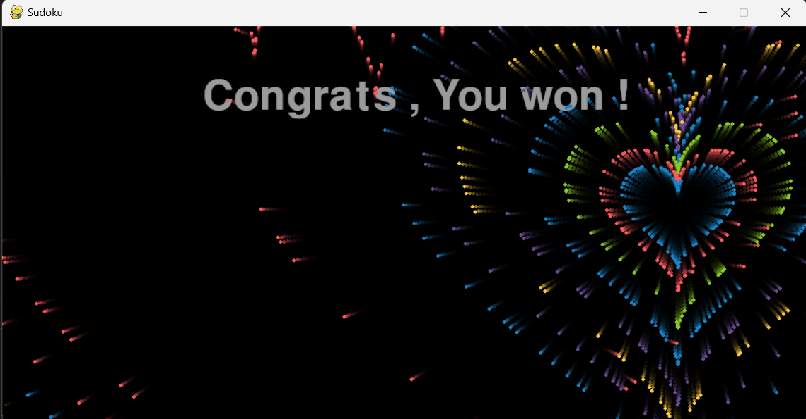

# Games Made within Python

### Completed Games (working):

#### Sudoku

Sudoku game initialized by one of million sudoku games from data-set stolen from kaggle .
(made this game it to use it for AI solver in future)

Here are some pictures :

###### Start page

###### play

###### win

#### TicTacToe

General TicTacToe game with pygame

pics :
###### Start page

###### play

###### win

### Shelved Games (To be developed in future):

* Chess (too complicated)
